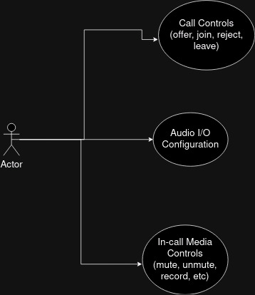
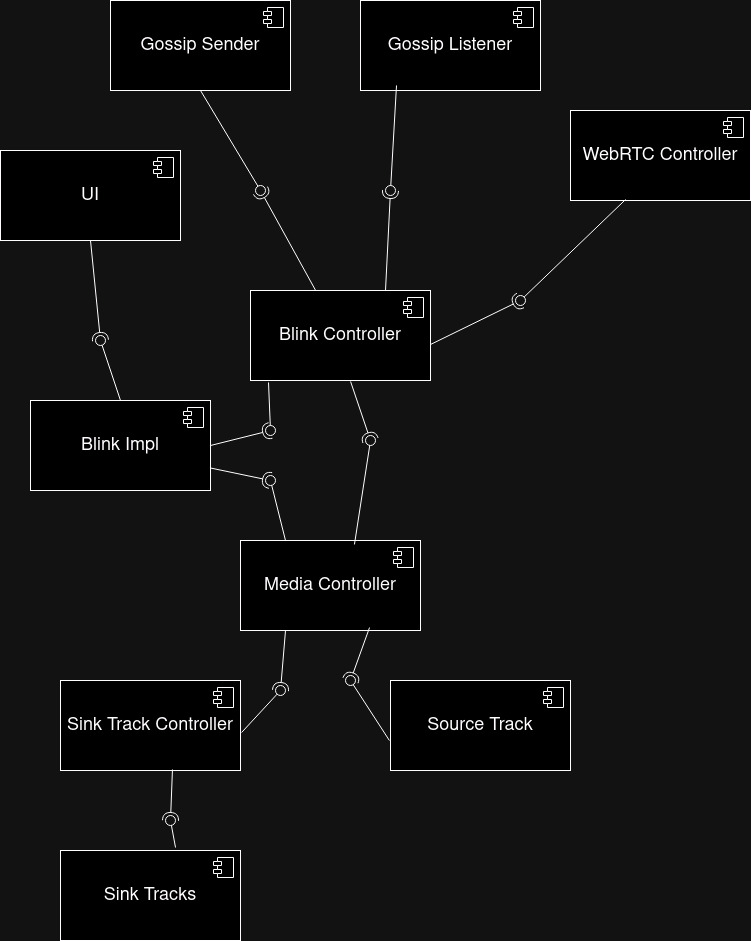

# warp-blink-wrtc

## Actor Diagram

## Component Diagram

## Introduction
This extension is an implementation of the [Blink trait](https://github.com/Satellite-im/Warp/blob/main/warp/src/blink/mod.rs), providing teleconferencing capabilities. There main modules are:
- [simple-webrtc](https://github.com/Satellite-im/Warp/blob/main/extensions/warp-blink-wrtc/src/simple_webrtc/mod.rs): built on top of the [webrtc-rs](https://github.com/webrtc-rs/webrtc) crate, manages multiple concurrent peer connections and their associated media streams.
- [host-media](https://github.com/Satellite-im/Warp/blob/main/extensions/warp-blink-wrtc/src/host_media): deals with audio I/O using the following modules:
    - [audio/sink](https://github.com/Satellite-im/Warp/tree/main/extensions/warp-blink-wrtc/src/host_media/audio/sink): reads RTP packets from a stream, decodes them, and feeds them to the output device
    - [audio/source](https://github.com/Satellite-im/Warp/tree/main/extensions/warp-blink-wrtc/src/host_media/audio/source): reads audio from an input device, encodes it, splits the opus frames into RTP packets, and writes them to a stream.
    - [mp4_logger](https://github.com/Satellite-im/Warp/tree/main/extensions/warp-blink-wrtc/src/host_media/mp4_logger): writes opus packets to an mp4 file, using a different track for each concurrent audio stream.
    - [loopback](https://github.com/Satellite-im/Warp/tree/main/extensions/warp-blink-wrtc/src/host_media/loopback): exists for testing purposes; used with the `loopback_controller`.
- [blink-impl](https://github.com/Satellite-im/Warp/tree/main/extensions/warp-blink-wrtc/src/blink_impl): implements the `Blink` trait, providing a unified API for the following:
    - selecting audio I/O devices
    - initiating audio calls with one or more peers
    - answering/declining calls
    - mute/unmute self
    - record call

## blink-impl

### Background
Peers are discovered using the IPFS network. WebRTC signaling is performed using gossip (exposed by the IPFS crate).

### Overview
The core of the `blink-impl` module is a `BlinkController` which manages external commands and signals from WebRTC and gossipsub.
Diagrams are provided for the more complicated modules.

#### BlinkController Thread

#### GossipListener Thread

